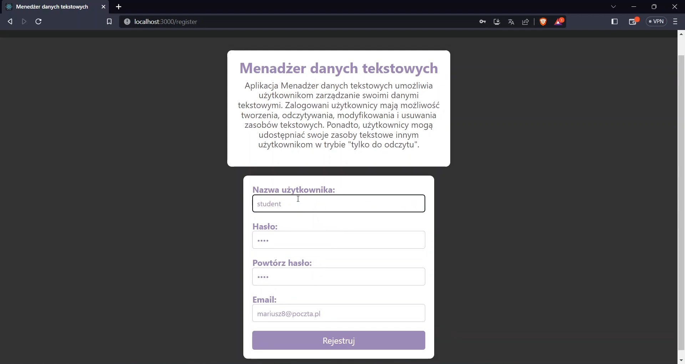
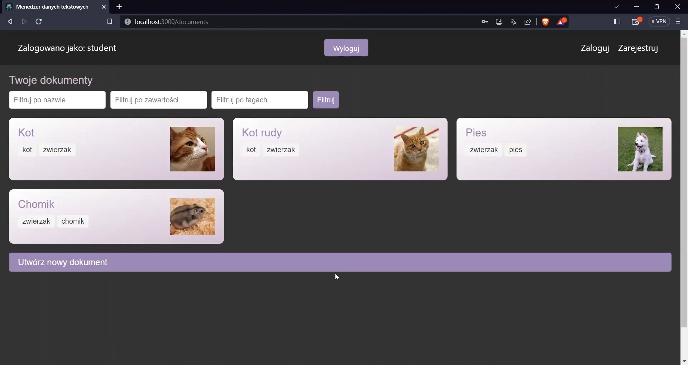
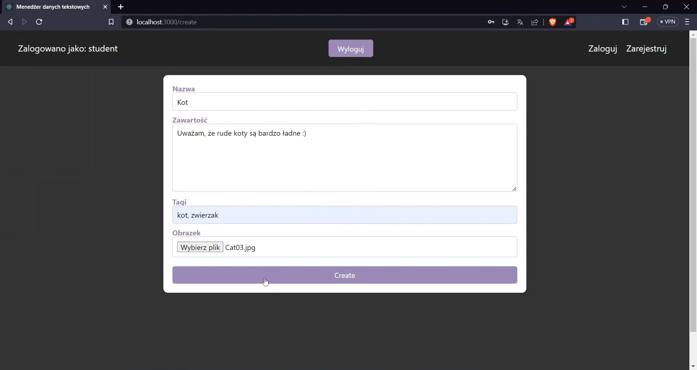
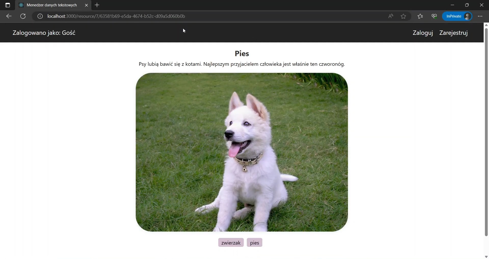

# Text Resource Management App

## Description

An application for managing text resources that allows users to register, log in, and reset their passwords. After logging in, users have access to a view of available resources and can create new entries. Each resource can contain images and tags, and users can filter resources by tags and names. The application also supports editing, deleting, and sharing resources via special links. Security and authentication are handled using JSON Web Tokens (JWT).

## Technologies

### Frontend
- React
- Axios
- Formik
- Yup
- react-router-dom

### Backend
- Java
- Spring Boot
- Hibernate
- Lombok
- JSON Web Token (JWT)

